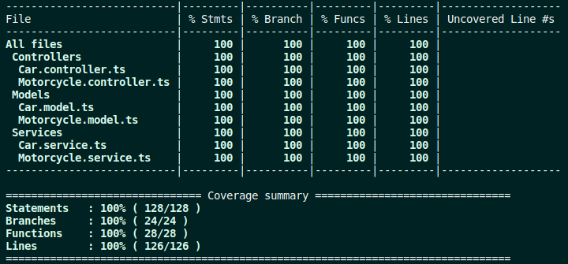

# Car Shop API
Esta é uma API construída com base nos princípios da Programação Orientada a Objetos (POO) para gerenciar uma concessionária de veículos, utilizando o banco de dados MongoDB através do framework Mongoose. A API permite a criação, leitura, atualização e exclusão de veículos, bem como a visualização de uma lista de todos os veículos disponíveis na concessionária.

## Tecnologias utilizadas

-   Node.js
- TypeScript
-   Express
-   Mongo
- Mongoose
-   Docker
-   Jest
- Mocha
- Chai

## Instalação e uso

1.  Clone este repositório para sua máquina local

```bash
git clone git@github.com:pedroayresb/car-shop-api.git
```

2.  Entre na pasta do projeto
```bash
cd car-shop-api
```
3.  Instale as dependencias; Isso ja ira instalar tanto o front quanto o backend
```bash
npm install 
```
4.  Execute o docker-compose
```bash
docker compose up
```

A aplicação utiliza as portas `3001`  e  `27017`  , certifique-se que elas estão disponíveis no momento de executar o comando.

## Testes

A aplicação possui testes desenvolvidos para cobrir as suas principais camadas. 


## Documentação da API

### Endpoint:  `/cars`

#### Método:  `GET`

Descrição: Lista todos os carros disponíveis no banco de dados.

Respostas:

-   200 OK: Retorna todos os carros.
-   400 Bad Request: Todos os campos devem estar preenchidos.
-   401 Unauthorized: Email ou senha incorretos.

##### Exemplo de resposta de sucesso:
```json
status: 200
  [
    {
      "id": "634852326b35b59438fbea2f",
      "model": "Marea",
      "year": 2002,
      "color": "Black",
      "status": true,
      "buyValue": 15.99,
      "doorsQty": 4,
      "seatsQty": 5
    },
    {
      "id": "634852326b35b59438fbea31",
      "model": "Tempra",
      "year": 1995,
      "color": "Black",
      "buyValue": 39,
      "doorsQty": 2,
      "seatsQty": 5
    }
  ]
```
#### Método:  `POST`

Descrição: Cria um novo carro no banco.

Respostas:

-   200 OK: Cria o carro especifico.

Request Body:
```json
    {
      "model": "Tempra",
      "year": 1995,
      "color": "Black",
      "buyValue": 39,
      "doorsQty": 2,
      "seatsQty": 5
    }
```

##### Exemplo de resposta de sucesso:
```json
status: 200
    {
      "id": "634852326b35b59438fbea31",
      "model": "Tempra",
      "year": 1995,
      "color": "Black",
      "buyValue": 39,
      "doorsQty": 2,
      "seatsQty": 5
    }
```


### Endpoint:  `/cars/:id`


#### Método:  `GET`

Descrição: Retorna o carro especifico.

Respostas:

-   200 OK: Retorna o carro especifico.
-   404 Not Found: Carro nao existe no banco.
-   422 Unprocessable Entity: Id Mongo Invalido.

##### Exemplo de resposta de sucesso:
```json
status: 200
   {
     "id": "634852326b35b59438fbea2f",
     "model": "Marea",
     "year": 2002,
     "color": "Black",
     "status": true,
     "buyValue": 15.99,
     "doorsQty": 4,
     "seatsQty": 5
   }
```
##### Exemplo de resposta de erro (Email ou senha incorretos):
```json
status: 404
{
   "message": "Car not found" 
}
```
##### Exemplo de resposta de erro (Todos os campos devem estar preenchidos):
```json
status: 422
{
  "message": "Invalid mongo id"
}
```

#### Método:  `PUT`

Descrição: Atualiza o carro pelo id.

Respostas:

-   200 OK: Atualiza o carro especifico.
-   404 Not Found: Carro nao existe no banco.
-   422 Unprocessable Entity: Id Mongo Invalido.

Request Body:
```json
{
  "model": "Marea",
  "year": 1992,
  "color": "Red",
  "status": true,
  "buyValue": 12.000,
  "doorsQty": 2,
  "seatsQty": 5
}
```

##### Exemplo de resposta de sucesso:
```json
status: 200
   {
     "id": "634852326b35b59438fbea2f",
     "model": "Marea",
     "year": 2002,
     "color": "Black",
     "status": true,
	  "buyValue": 12.000,
	  "doorsQty": 2,
	  "seatsQty": 5
   }
```
##### Exemplo de resposta de erro (Email ou senha incorretos):
```json
status: 404
{
   "message": "Car not found" 
}
```
##### Exemplo de resposta de erro (Todos os campos devem estar preenchidos):
```json
status: 422
{
  "message": "Invalid mongo id"
}
```

#### Método:  `DELETE`

Descrição: Deleta o carro pelo id.

Respostas:

-   200 OK: Deleta o carro especifico.
-   404 Not Found: Carro nao existe no banco.
-   422 Unprocessable Entity: Id Mongo Invalido.


##### Exemplo de resposta de sucesso:
```json
status: 200
   {
     "id": "634852326b35b59438fbea2f",
     "model": "Marea",
     "year": 2002,
     "color": "Black",
     "status": true,
	  "buyValue": 12.000,
	  "doorsQty": 2,
	  "seatsQty": 5
   }
```
##### Exemplo de resposta de erro (Email ou senha incorretos):
```json
status: 404
{
   "message": "Car not found" 
}
```
##### Exemplo de resposta de erro (Todos os campos devem estar preenchidos):
```json
status: 422
{
  "message": "Invalid mongo id"
}
```

### Endpoint:  `/motorcycles`

#### Método:  `GET`

Descrição: Lista todos as motos disponíveis no banco de dados.

Respostas:

-   200 OK: Retorna todos as motos.

##### Exemplo de resposta de sucesso:
```json
status: 200
  [
    {
      "id": "634852326b35b59438fbea2f",
      "model": "Honda Cb 600f Hornet",
      "year": 2005,
      "color": "Yellow",
      "status": true,
      "buyValue": 30.000,
      "category": "Street",
      "engineCapacity": 600
    },
    {
      "id": "634852326b35b59438fbea31",
      "model": "Honda Cbr 1000rr",
      "year": 2011,
      "color": "Orange",
      "status": true,
      "buyValue": 59.900,
      "category": "Street",
      "engineCapacity": 1000
    }
  ]
```
#### Método:  `POST`

Descrição: Cria uma nova moto no banco.

Respostas:

-   200 OK: Cria uma moto no bando.

Request Body:
```json
{
  "model": "Honda Cb 600f Hornet",
  "year": 2005,
  "color": "Yellow",
  "status": true,
  "buyValue": 30.000,
  "category": "Street",
  "engineCapacity": 600
}
```

##### Exemplo de resposta de sucesso:
```json
status: 200
 {
  "id": "634852326b35b59438fbea31",
  "model": "Honda Cb 600f Hornet",
  "year": 2005,
  "color": "Yellow",
  "status": true,
  "buyValue": 30.000,
  "category": "Street",
  "engineCapacity": 600
}
```


### Endpoint:  `/motorcycles/:id`


#### Método:  `GET`

Descrição: Retorna uma moto especifica.

Respostas:

-   200 OK: Retorna uma moto especifica.
-   404 Not Found: Moto nao existe no banco.
-   422 Unprocessable Entity: Id Mongo Invalido.

##### Exemplo de resposta de sucesso:
```json
status: 200
    {
      "id": "634852326b35b59438fbea31",
      "model": "Honda Cbr 1000rr",
      "year": 2011,
      "color": "Orange",
      "status": true,
      "buyValue": 59.900,
      "category": "Street",
      "engineCapacity": 1000
    }
```
##### Exemplo de resposta de erro (Email ou senha incorretos):
```json
status: 404
{
   "message": "Motorcycle not found" 
}
```
##### Exemplo de resposta de erro (Todos os campos devem estar preenchidos):
```json
status: 422
{
  "message": "Invalid mongo id"
}
```

#### Método:  `PUT`

Descrição: Atualiza uma moto pelo id.

Respostas:

-   200 OK: Atualiza o carro especifico.
-   404 Not Found: Moto nao existe no banco.
-   422 Unprocessable Entity: Id Mongo Invalido.

Request Body:
```json
{
  "model": "Honda Cb 600f Hornet",
  "year": 2014,
  "color": "Red",
  "status": true,
  "buyValue": 45.000,
  "category": "Street",
  "engineCapacity": 600
}
```

##### Exemplo de resposta de sucesso:
```json
status: 200
   {
      "id": "634852326b35b59438fbea2f",
	  "model": "Honda Cb 600f Hornet",
	  "year": 2014,
	  "color": "Red",
	  "status": true,
	  "buyValue": 45.000,
	  "category": "Street",
	  "engineCapacity": 600
   }
```
##### Exemplo de resposta de erro (Email ou senha incorretos):
```json
status: 404
{
   "message": "Motorcycle not found" 
}
```
##### Exemplo de resposta de erro (Todos os campos devem estar preenchidos):
```json
status: 422
{
  "message": "Invalid mongo id"
}
```

#### Método:  `DELETE`

Descrição: Deleta uma moto pelo id.

Respostas:

-   200 OK: Deleta uma moto especifica.
-   404 Not Found: Moto nao existe no banco.
-   422 Unprocessable Entity: Id Mongo Invalido.


##### Exemplo de resposta de sucesso:
```json
status: 200
   {
      "id": "634852326b35b59438fbea2f",
	  "model": "Honda Cb 600f Hornet",
	  "year": 2014,
	  "color": "Red",
	  "status": true,
	  "buyValue": 45.000,
	  "category": "Street",
	  "engineCapacity": 600
   }
```
##### Exemplo de resposta de erro (Email ou senha incorretos):
```json
status: 404
{
   "message": "Motorcycle not found" 
}
```
##### Exemplo de resposta de erro (Todos os campos devem estar preenchidos):
```json
status: 422
{
  "message": "Invalid mongo id"
}
```